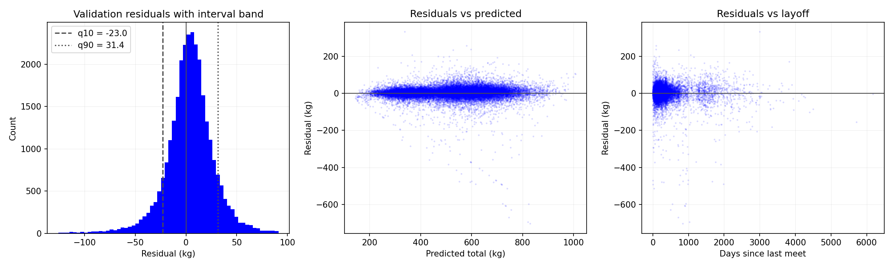

# Model Evaluation

Time-base split.
Train: 1969-03-02 to 2023-03-31
Test: 2024-07-13 to 2025-09-21

Model MAE is **19.1 kg** vs **23.1 kg** for simply repeating the lifter's previous total, a **17.1% reduction in error** over the persistance baseline

## Model vs baselines
|                              |     MAE |    RMSE |     R2 |
|:-----------------------------|--------:|--------:|-------:|
| Predict training mean        | 135.347 | 159.548 | -0.029 |
| Persistance (previous total) |  23.058 |  40.958 |  0.932 |
| Model                        |  19.114 |  31.912 |  0.959 |
## Error by segment (MAE, kg)
### Days since last meet

| bucket      |     n |   model_mae |   persistance_mae |
|:------------|------:|------------:|------------------:|
| <3 months   |  5347 |        15.2 |              17.4 |
| 3-6 months  |  9764 |        15.8 |              18.6 |
| 6-12 months | 10086 |        18.5 |              23.1 |
| 1-2 years   |  2986 |        24.2 |              31.1 |
| >2 years    |  1444 |        49.7 |              57   |

### Number of prior meets

| bucket   |     n |   model_mae |   persistance_mae |
|:---------|------:|------------:|------------------:|
| 2-3      | 12838 |        19.7 |              25.7 |
| 4-5      |  6677 |        18.5 |              21.9 |
| 6-10     |  6641 |        19   |              21.1 |
| >10      |  3476 |        18.6 |              19.1 |

## Residual diagnostics

